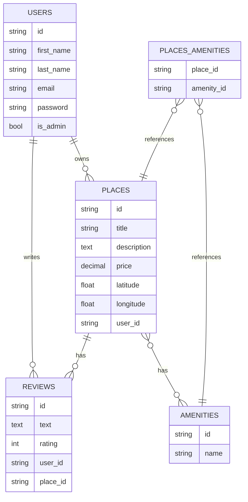

1. Diagramme ER en Mermaid.js
Voici le diagramme ER généré à partir des fichiers que tu as fournis :

2. Explication du Diagramme
Entités (Tables)
USERS

Attributs : id, first_name, last_name, email, password, is_admin

Relations :

Un USER peut posséder plusieurs PLACES (One-to-Many).

Un USER peut écrire plusieurs REVIEWS (One-to-Many).

PLACES

Attributs : id, title, description, price, latitude, longitude, user_id

Relations :

Une PLACE appartient à un USER (via user_id).

Une PLACE peut avoir plusieurs REVIEWS (One-to-Many).

Une PLACE peut avoir plusieurs AMENITIES (Many-to-Many via PLACES_AMENITIES).

REVIEWS

Attributs : id, text, rating, user_id, place_id

Relations :

Une REVIEW est écrite par un USER (via user_id).

Une REVIEW est associée à une PLACE (via place_id).

AMENITIES

Attributs : id, name

Relations :

Un AMENITY peut être associé à plusieurs PLACES (Many-to-Many via PLACES_AMENITIES).

PLACES_AMENITIES (Table de jointure)

Attributs : place_id, amenity_id

Relations :

PLACES_AMENITIES lie une PLACE à un AMENITY.

3. Relations
USERS ||--o{ PLACES : Un utilisateur peut posséder plusieurs places (One-to-Many).

USERS ||--o{ REVIEWS : Un utilisateur peut écrire plusieurs reviews (One-to-Many).

PLACES ||--o{ REVIEWS : Une place peut avoir plusieurs reviews (One-to-Many).

PLACES }o--o{ AMENITIES : Une place peut avoir plusieurs commodités, et une commodité peut être associée à plusieurs places (Many-to-Many).

PLACES_AMENITIES }o--|| PLACES : La table de jointure référence une place.

PLACES_AMENITIES }o--|| AMENITIES : La table de jointure référence une commodité.