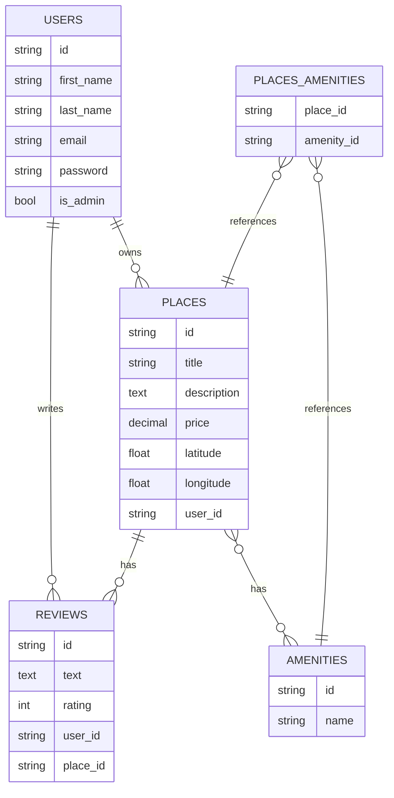

### **1. Diagramme ER Structuré en Mermaid.js**

Voici le diagramme ER réorganisé pour ressembler à la structure du projet de bot Discord :

### **2. Explication des Modifications**

#### **a. Sections Structurées**

- **Section 1 : Entités principales** : Les tables (`USERS`, `PLACES`, `REVIEWS`, `AMENITIES`, `PLACES_AMENITIES`) sont listées avec leurs attributs.
    
- **Section 2 : Relations entre les entités** : Les relations entre les tables sont clairement définies.
    
- **Section 3 : Légendes et descriptions** : Chaque entité est accompagnée d'une note explicative pour décrire son rôle et ses relations.
    

#### **b. Légendes et Descriptions**

- Les notes (`note right of`) ajoutent des descriptions détaillées pour chaque entité, ce qui rend le diagramme plus **compréhensible** et **professionnel**.
    
- Ces notes sont visibles dans l'éditeur Mermaid.js et peuvent être exportées avec le diagramme.