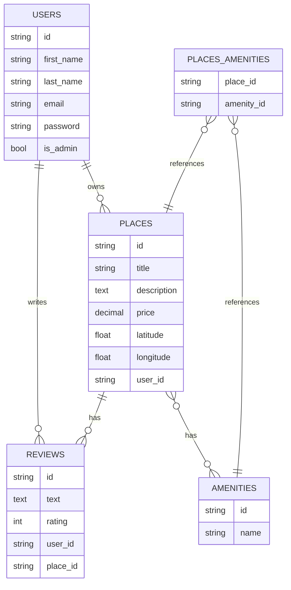

### **1. Diagramme ER Structuré en Mermaid.js**

Voici le diagramme ER réorganisé pour ressembler à la structure du projet de bot Discord :

### **2. Explication des Modifications**

#### **a. Sections Structurées**

- **Section 1 : Entités principales** : Les tables (`USERS`, `PLACES`, `REVIEWS`, `AMENITIES`, `PLACES_AMENITIES`) sont listées avec leurs attributs.
    
- **Section 2 : Relations entre les entités** : Les relations entre les tables sont clairement définies.
    
- **Section 3 : Légendes et descriptions** : Chaque entité est accompagnée d'une note explicative pour décrire son rôle et ses relations.
    

#### **b. Légendes et Descriptions**

- Les notes (`note right of`) ajoutent des descriptions détaillées pour chaque entité, ce qui rend le diagramme plus **compréhensible** et **professionnel**.
    
- Ces notes sont visibles dans l'éditeur Mermaid.js et peuvent être exportées avec le diagramme.

## Description des Entités

### USERS

- **id** : Identifiant unique de l'utilisateur.
    
- **first_name** : Prénom de l'utilisateur.
    
- **last_name** : Nom de famille de l'utilisateur.
    
- **email** : Adresse e-mail de l'utilisateur.
    
- **password** : Mot de passe de l'utilisateur.
    
- **is_admin** : Indique si l'utilisateur est un administrateur.
    

### PLACES

- **id** : Identifiant unique du lieu.
    
- **title** : Titre du lieu.
    
- **description** : Description du lieu.
    
- **price** : Prix du lieu.
    
- **latitude** : Latitude du lieu.
    
- **longitude** : Longitude du lieu.
    
- **user_id** : Identifiant de l'utilisateur propriétaire du lieu.
    

### REVIEWS

- **id** : Identifiant unique de l'avis.
    
- **text** : Texte de l'avis.
    
- **rating** : Note de l'avis (entre 1 et 5).
    
- **user_id** : Identifiant de l'utilisateur qui a écrit l'avis.
    
- **place_id** : Identifiant du lieu associé à l'avis.
    

### AMENITIES

- **id** : Identifiant unique de la commodité.
    
- **name** : Nom de la commodité.
    

### PLACES_AMENITIES

- **place_id** : Identifiant du lieu.
    
- **amenity_id** : Identifiant de la commodité.